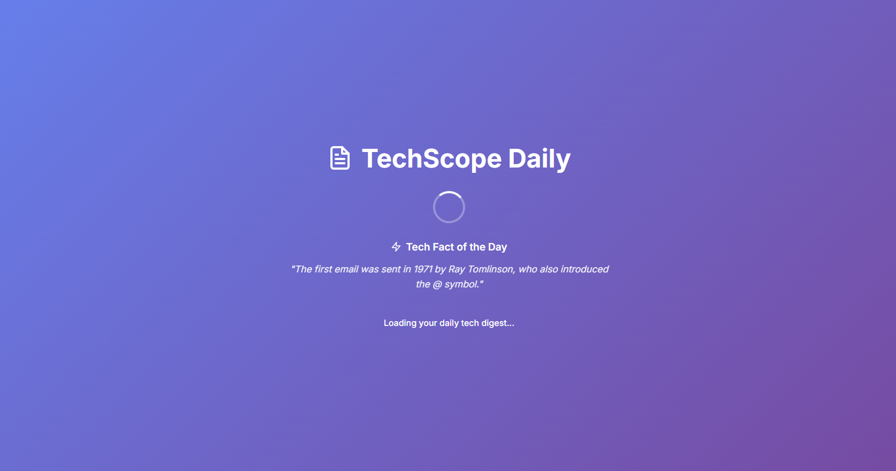
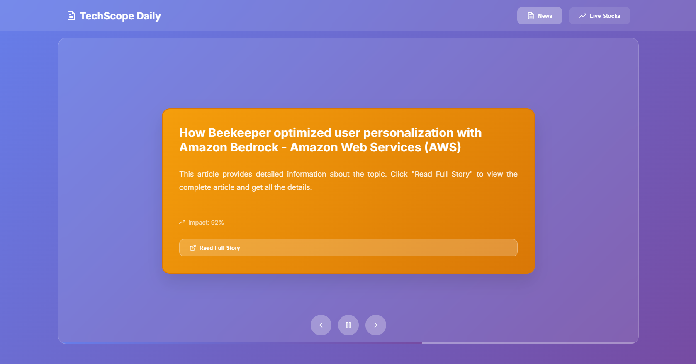
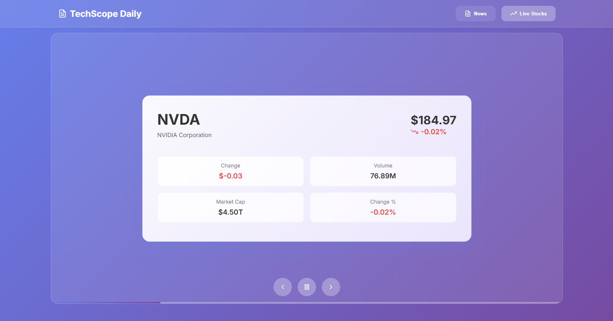

# 📰 TechScope Daily

<div align="center">

**AI-Powered Tech News Platform | Your Daily Tech Digest**

[](https://fastapi.tiangolo.com/)
[](https://reactjs.org/)
[](https://www.typescriptlang.org/)
[](https://www.python.org/)

*Stay informed with the latest tech news, stock updates, and AI-generated insights*

</div>

---

## 🎯 Overview

**TechScope Daily** is a modern, AI-powered tech news platform that delivers personalized daily tech insights, breaking news, market updates, and fascinating tech facts. Built with FastAPI and React, it provides a beautiful, responsive interface for staying up-to-date with the tech world.

### Key Highlights

- ✨ **Daily Updates**: Fresh content every day - news, stocks, and facts
- 🤖 **AI-Powered**: Free AI integration for fact generation and content analysis
- 📊 **Stock Tracking**: Real-time data for major tech companies
- 🎨 **Modern UI**: Beautiful glassmorphism design with smooth animations
- 🔄 **Auto-Rotating Cards**: Sliding card interface for easy browsing

---

## ✨ Features

### 🧠 Daily Facts

<div align="center">
  
  <p><em>Loading screen displaying daily tech fact</em></p>
</div>

- **AI-Generated Facts**: Unique tech facts generated daily
- **Loading Screen Display**: Facts shown during app startup
- **Daily Rotation**: New fact every day at midnight
- **Free AI Integration**: Uses Hugging Face API (no API key required)
- **Fallback Database**: 30+ facts per category for reliability

### 📰 News Section

<div align="center">
  
  <p><em>News feed with article cards and impact scoring</em></p>
</div>

- **Daily Tech News**: Curated news from Google News and Wired.com
- **Breaking News Alerts**: Real-time breaking news with importance scoring
- **AI Analysis**: Automatic sentiment and impact analysis
- **Content Extraction**: Full article content previews
- **Source Filtering**: Focused on quality tech sources

### 📈 Stocks Section

<div align="center">
  
  <p><em>Stock tracking with real-time data and metrics</em></p>
</div>

- **Major Tech Stocks**: Track 10 major tech companies (AAPL, MSFT, GOOGL, AMZN, TSLA, META, NVDA, NFLX, ADBE, CRM)
- **Daily Updates**: Stock data refreshed daily at market open
- **Real-time Metrics**: Price, change, volume, and market cap
- **Visual Indicators**: Color-coded gains/losses
- **Formatted Data**: Easy-to-read number formatting (B, M, K)

---

## 🚀 Upcoming Features

We're constantly working to improve TechScope Daily! Here's what's coming next:

### 👤 User Authentication & Accounts

- **Individual User Accounts**: Each user will be able to create their own account and login separately
- **Secure Authentication**: JWT-based authentication system for secure user sessions
- **Profile Management**: Users can customize their profiles, preferences, and settings
- **Account Settings**: Full account management including password changes, email updates, and profile customization

### 📰 Personalized News Feed

- **Custom News Preferences**: Users will be able to choose what types of news they want to focus on
- **Topic Selection**: Select from categories like:
  - Artificial Intelligence & Machine Learning
  - Cybersecurity
  - Startups & Funding
  - Cloud Computing
  - Mobile Technology
  - Gaming & Entertainment Tech
  - And more...
- **Priority Viewing**: Your selected topics will appear first in your personalized feed
- **News Filtering**: Filter news by category, source, date range, and importance
- **Saved Articles**: Bookmark articles for later reading
- **Reading History**: Track articles you've read

### 📈 Custom Stock Tracking

- **Personal Stock Watchlist**: Users can pick their favorite stocks and add them to a personal watchlist
- **Custom Stock Selection**: Choose from any stock symbol, not just the default tech companies
- **Portfolio Tracking**: Track multiple stocks in your personalized portfolio
- **Stock Alerts**: Set up price alerts for your tracked stocks
- **Performance Analytics**: View detailed analytics for your selected stocks
- **Comparison Tools**: Compare performance across your selected stocks

---

## 🛠️ Tech Stack

### Backend
| Technology | Purpose |
|------------|---------|
| **FastAPI** | Modern Python web framework |
| **SQLAlchemy** | Database ORM |
| **SQLite** | Lightweight database |
| **yfinance** | Stock market data |
| **BeautifulSoup4** | Web scraping for news |
| **Hugging Face API** | Free AI for fact generation |
| **Schedule** | Background task scheduling |

### Frontend
| Technology | Purpose |
|------------|---------|
| **React 18** | UI framework |
| **TypeScript** | Type safety |
| **Styled Components** | CSS-in-JS styling |
| **Framer Motion** | Animations |
| **React Icons** | Icon library |
| **Axios** | HTTP client |

---

## 📁 Project Structure

```
TechScope Daily/
├── backend/
│   ├── app/
│   │   ├── ai/
│   │   │   └── content_generator.py    # AI fact generation & news analysis
│   │   ├── api/
│   │   │   └── routes/
│   │   │       ├── news.py            # News endpoints
│   │   │       ├── breaking_news.py   # Breaking news endpoints
│   │   │       ├── stocks.py          # Stock endpoints
│   │   │       └── facts.py            # Daily facts endpoints
│   │   ├── core/
│   │   │   └── config.py              # Configuration & settings
│   │   ├── models/
│   │   │   └── database.py             # Database models
│   │   └── services/
│   │       ├── news_service.py         # News business logic
│   │       ├── breaking_news_service.py # Breaking news fetching
│   │       ├── stock_service.py        # Stock data management
│   │       └── scheduler.py            # Daily task scheduler
│   ├── main.py                         # FastAPI app entry point
│   ├── requirements.txt                 # Python dependencies
│   └── techscope_daily.db              # SQLite database
│
├── frontend/
│   ├── src/
│   │   ├── components/
│   │   │   ├── Header.tsx              # Navigation header
│   │   │   ├── SlidingCards.tsx        # Card carousel container
│   │   │   ├── NewsSection.tsx         # News card component
│   │   │   ├── StocksSection.tsx       # Stock card component
│   │   │   └── LoadingSpinner.tsx      # Loading screen with facts
│   │   ├── App.tsx                     # Main app component
│   │   ├── index.tsx                   # React entry point
│   │   └── index.css                   # Global styles
│   ├── package.json                    # Node.js dependencies
│   └── build/                          # Production build
│
├── README.md                            # This file
└── setup.md                             # Detailed setup guide
```

---

## 🚀 Getting Started

### Prerequisites

- **Python 3.8+** - [Download](https://www.python.org/downloads/)
- **Node.js 16+** - [Download](https://nodejs.org/)
- **Git** - [Download](https://git-scm.com/)

### Installation

#### 1. Clone the Repository

```bash
git clone <repository-url>
cd "TechScope Daily"
```

#### 2. Backend Setup

```bash
# Create virtual environment
python -m venv venv

# Activate virtual environment
# Windows:
venv\Scripts\activate
# macOS/Linux:
source venv/bin/activate

# Navigate to backend
cd backend

# Install dependencies
pip install -r requirements.txt

# Initialize database (creates tables automatically on first run)
# Database will be created automatically when you start the server
```

#### 3. Frontend Setup

```bash
# Navigate to frontend (from project root)
cd frontend

# Install dependencies
npm install
```

#### 4. Environment Configuration

Create a `.env` file in the `backend` directory (optional - works without API keys):

```env
# Optional: For enhanced AI features (uses free Hugging Face by default)
OPENAI_API_KEY=your_openai_key_here

# Optional: Not currently required (using Google News RSS & Wired.com)
NEWS_API_KEY=your_news_api_key_here

# Optional: Not currently required (using yfinance)
ALPHA_VANTAGE_API_KEY=your_alpha_vantage_key_here
```

> **Note**: The app works without API keys! It uses free services (Hugging Face AI, Google News RSS, Wired.com RSS, yfinance) by default.

---

## 🎮 Running the Application

### Start Backend Server

```bash
cd backend
uvicorn main:app --reload
```

The backend will be available at: **http://localhost:8000**

### Start Frontend Development Server

```bash
cd frontend
npm start
```

The frontend will be available at: **http://localhost:3000**

### Access Points

- **Frontend Application**: http://localhost:3000
- **Backend API**: http://localhost:8000
- **API Documentation (Swagger)**: http://localhost:8000/docs
- **Alternative API Docs (ReDoc)**: http://localhost:8000/redoc

---

## 🤝 Contributing

Contributions are welcome! Please follow these steps:

1. **Fork the repository**
2. **Create a feature branch**
   ```bash
   git checkout -b feature/amazing-feature
   ```
3. **Make your changes**
4. **Commit your changes**
   ```bash
   git commit -m 'Add some amazing feature'
   ```
5. **Push to the branch**
   ```bash
   git push origin feature/amazing-feature
   ```
6. **Open a Pull Request**

### Development Guidelines

- Follow existing code style
- Add comments for complex logic
- Update documentation for new features
- Test your changes before submitting

---

## 📄 License

This project is licensed under the **MIT License** - see the [LICENSE](LICENSE) file for details.
